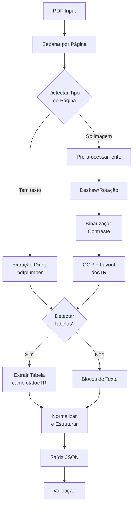

# Implementação do Pipeline de Extração de Documentos

## Arquitetura do Pipeline




## Bibliotecas Necessárias

### Core PDF e Imagem

```
pdfplumber>=0.11.0          # Extração de texto digital + tabelas
pypdf>=4.0.0                # Manipulação de PDFs
pdf2image>=1.17.0           # Converter PDF para imagem
Pillow>=10.0.0              # Processamento de imagem
```

### Pré-processamento de Imagem

```
opencv-python>=4.9.0        # Deskew, binarização, filtros
numpy>=1.24.0               # Arrays e operações numéricas
scikit-image>=0.22.0        # Algoritmos de imagem avançados
```

### OCR e Layout (PyTorch + ROCm)

```
torch>=2.0.0                # PyTorch com suporte ROCm
python-doctr>=0.8.0         # OCR + Layout detection (PyTorch)
transformers>=4.35.0        # Modelos Hugging Face (opcional)
```

### Extração de Tabelas

```
camelot-py[base]>=0.11.0    # Tabelas de PDFs digitais
ghostscript                 # Dependência do camelot (instalar via sistema)
```

### Utilitários

```
tqdm>=4.66.0                # Barras de progresso
pydantic>=2.5.0             # Validação de schema JSON
python-dotenv>=1.0.0        # Configurações
```

## Estrutura de Diretórios

```
/lab/caseiro/doc_parser/
├── src/
│   ├── __init__.py
│   ├── pipeline.py              # Orquestrador principal
│   ├── detector.py              # Detecta tipo de página
│   ├── extractors/
│   │   ├── __init__.py
│   │   ├── digital.py           # Extração de PDF digital
│   │   ├── ocr.py               # OCR com docTR
│   │   └── tables.py            # Extração de tabelas
│   ├── preprocessing/
│   │   ├── __init__.py
│   │   ├── image_enhancer.py   # Deskew, binarização
│   │   └── layout.py            # Detecção de layout
│   ├── models/
│   │   ├── __init__.py
│   │   └── schemas.py           # Pydantic schemas
│   └── utils/
│       ├── __init__.py
│       ├── bbox.py              # Funções de bounding box
│       └── text_normalizer.py  # Limpeza de texto
├── tests/
│   ├── __init__.py
│   ├── test_pipeline.py
│   └── test_extractors.py
├── scripts/
│   ├── process_single.py        # Processa 1 PDF
│   └── validate_quality.py      # Script de validação
├── resource/                    # PDFs de entrada
├── output/                      # JSONs de saída
├── config.py                    # Configurações
├── requirements.txt
└── README.md
```

## Schema JSON de Saída

```json
{
  "doc_id": "1008086-69.2016.8.26.0005",
  "source_file": "1008086-69.2016.8.26.0005.pdf",
  "total_pages": 10,
  "processing_date": "2026-01-31T10:30:00Z",
  "pages": [
    {
      "page": 1,
      "source": "digital" | "ocr",
      "blocks": [
        {
          "block_id": "p1_b1",
          "type": "paragraph",
          "text": "Texto do parágrafo...",
          "bbox": [0.1, 0.2, 0.9, 0.3],
          "confidence": 0.95
        },
        {
          "block_id": "p1_t1",
          "type": "table",
          "bbox": [0.1, 0.4, 0.9, 0.7],
          "rows": [
            ["Data", "Descrição", "Valor"],
            ["01/01/2024", "Pagamento", "R$ 1.200,00"]
          ],
          "confidence": 0.88
        }
      ]
    }
  ]
}
```

## Componentes Principais

### 1. Detector de Tipo (`[src/detector.py](src/detector.py)`)

- Verifica se página tem texto selecionável
- Retorna "digital" ou "scan"
- Utiliza `pdfplumber` para tentar extrair texto

### 2. Extrator Digital (`[src/extractors/digital.py](src/extractors/digital.py)`)

- Extrai texto e posição com `pdfplumber`
- Detecta e extrai tabelas com `camelot`
- Agrupa em blocos por posição (y, x)

### 3. Pré-processador (`[src/preprocessing/image_enhancer.py](src/preprocessing/image_enhancer.py)`)

- Deskew: corrige rotação com OpenCV
- Binarização: Otsu ou adaptativa
- Remoção de ruído: filtros morfológicos
- Normalização de resolução (300 DPI)

### 4. Extrator OCR (`[src/extractors/ocr.py](src/extractors/ocr.py)`)

- Usa `docTR` (PyTorch) para OCR + layout
- Configurar para ROCm: `device='cuda'` (ROCm emula CUDA)
- Retorna blocos com texto, bbox e confiança

### 5. Extrator de Tabelas (`[src/extractors/tables.py](src/extractors/tables.py)`)

- Para digital: `camelot` (lattice ou stream)
- Para OCR: usar blocos de docTR + heurística de células
- Converte para lista de listas (rows)

### 6. Orquestrador (`[src/pipeline.py](src/pipeline.py)`)

Fluxo principal:

1. Abrir PDF
2. Para cada página:
  - Detectar tipo
  - Extrair (digital ou OCR)
  - Normalizar texto
  - Estruturar blocos
3. Gerar JSON final

### 7. Validador (`[scripts/validate_quality.py](scripts/validate_quality.py)`)

- Processa conjunto de teste (20-30 PDFs)
- Métricas:
  - Taxa de sucesso por página
  - Confiança média do OCR
  - Tabelas detectadas vs esperadas
- Gera relatório comparativo

## Configuração ROCm/PyTorch

Para usar a GPU AMD RX 7900 XT:

```python
# config.py
import torch

DEVICE = 'cuda' if torch.cuda.is_available() else 'cpu'
OCR_BATCH_SIZE = 4  # Ajustar conforme VRAM
IMAGE_DPI = 300
```

Verificar instalação ROCm:

```bash
python -c "import torch; print(torch.cuda.is_available())"
```

## Estratégia de Validação

1. Usar PDF de exemplo (`[resource/1008086-69.2016.8.26.0005.pdf](resource/1008086-69.2016.8.26.0005.pdf)`)
2. Processar manualmente 2-3 páginas críticas
3. Comparar saída JSON com original
4. Métricas:
  - Texto correto (acurácia por caractere)
  - Tabelas íntegras (linhas/colunas preservadas)
  - Ordem de leitura correta
5. Alvo: 85-90% de acurácia antes de escalar

## Otimizações para GPU

- Processar múltiplas páginas em batch (docTR)
- Pré-carregar modelo na GPU uma vez
- Usar `torch.no_grad()` para inferência
- Monitorar VRAM: `torch.cuda.memory_summary()`

## Próximos Passos (Pós-Validação)

1. Implementar chunking inteligente (por seção/página)
2. Adicionar metadados (tipo de documento, data, partes)
3. Pipeline de embeddings (quando validado)
4. Escalabilidade: processamento batch de múltiplos PDFs

